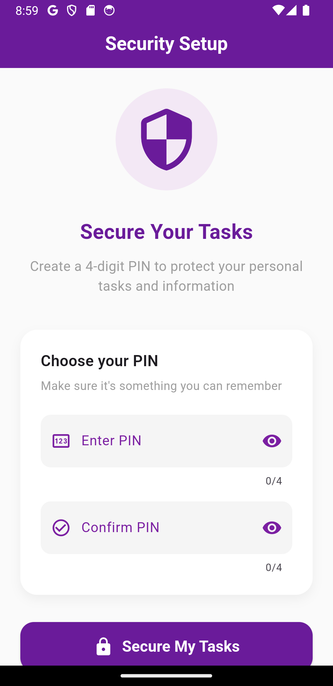
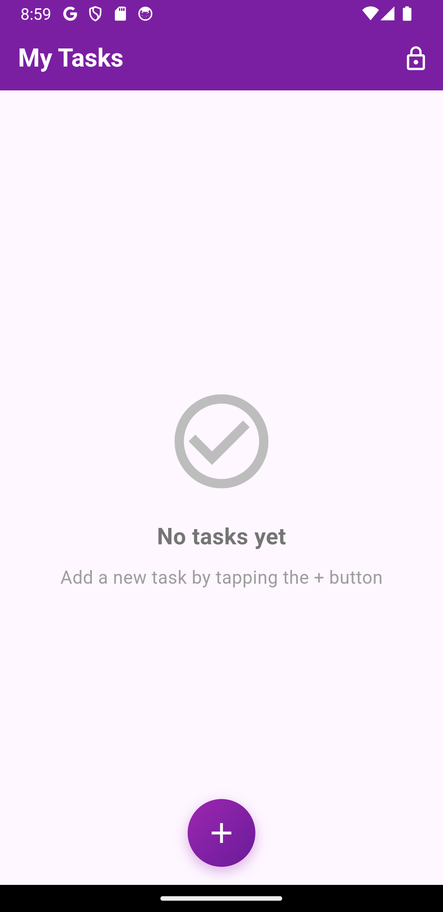
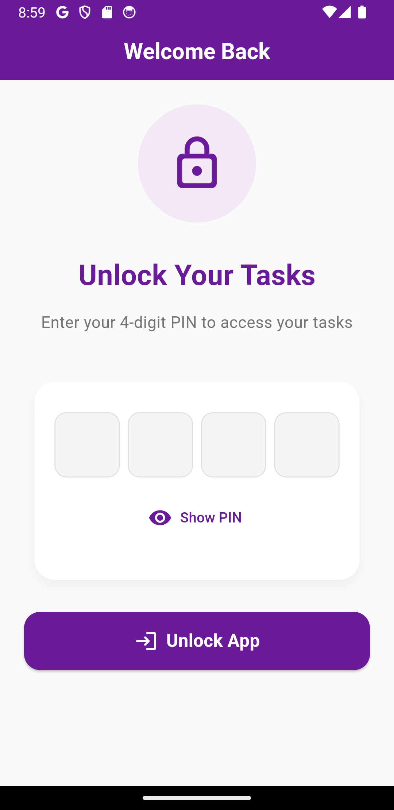
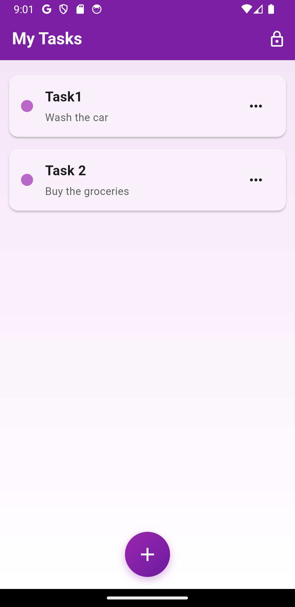
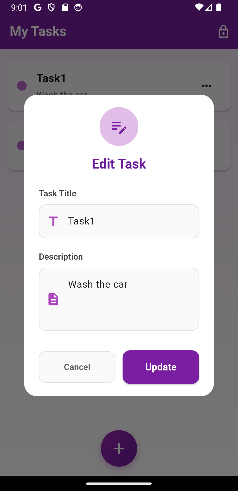

# 🛍️ wecodethat

**wecodethat** is a simple and elegant Flutter app that combines secure authentication with a user-friendly to-do list manager. It's designed to demonstrate modern app architecture using `Provider`, `Hive`, and `flutter_secure_storage`.

---

## 🚀 Features

- 🔐 **Secure PIN Authentication** using `flutter_secure_storage`
- ✅ **To-Do List Management** with persistent storage
- 🧠 **State Management** using `Provider`
- ⚡ **Local Database** with `Hive`

---

## 📸 Screenshots

  
  
  
  
  

---

## 💻 Technologies Used

- 🔷 **Flutter** – Cross-platform UI toolkit
- 🟡 **Dart** – Optimized language for UI development
- 📦 **Hive** – Lightweight & fast key-value database
- 🔐 **flutter_secure_storage** – For secure local storage of user PIN
- 🔄 **Provider** – State management solution

---

## 📝 License

This project is licensed under the **MIT License**.  
See the [LICENSE](LICENSE) file for full details.

---

## 🤝 Contributing

Contributions, issues, and feature requests are welcome!  
Feel free to check the [issues page](https://github.com/sayanthmk/wecodethat/issues) to contribute or report bugs.

---

## 👨‍💻 Author

**Sayanth MK**

- GitHub: [@sayanthmk](https://github.com/sayanthmk)
- LinkedIn: [@sayanthmk](https://linkedin.com/in/yourprofile)

---

⭐️ If you found this project helpful or inspiring, give it a **star** on GitHub!
